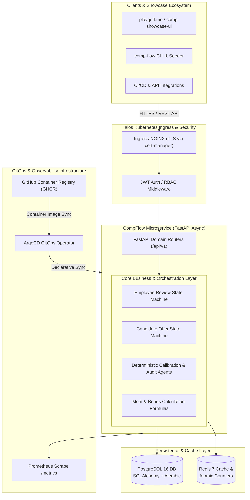

# CompFlow Platform: Enterprise Distributed Compensation Microservice

[](https://github.com/pedrogriff/comp-flow-platform/actions)
[](https://www.python.org/downloads/)
[](https://github.com/astral-sh/ruff)
[](https://mypy-lang.org/)
[]()
[](https://github.com/pedrogriff/homelab-k8s-talos)
[](https://github.com/pedrogriff/homelab-k8s-talos)

**CompFlow Platform** is a distributed, production-grade **Total Rewards Calibration & Offer Orchestration Microservice**. It combines deterministic policy auditing, dual-lifecycle state machines, and executive decision synthesis to govern:
1. **Current Employee Annual Compensation Planning Cycles**: Salary Merit Increase matrices, Bonus allocations ($\text{Base} \times \text{Target\%} \times \text{IPF} \times \text{CPF}$), Equity Refresh grants, Promotion calibrations, and Departmental Budget Pool depletion.
2. **New Hire Candidate Offer Generation & Approvals**: Location-tiered salary band enforcement (`US_ZONE_1`, `US_ZONE_2`, `US_ZONE_3`), sign-on bonus caps ($50,000 threshold), new hire equity caps, and multi-tier approval routing.
3. **Cloud-Native GitOps & Observability**: PostgreSQL 16 schema with Alembic async migrations, Redis 7 caching & atomic counters, Ingress-NGINX with cert-manager TLS, Prometheus metrics `/metrics`, and ArgoCD GitOps deployment on a bare-metal Talos Kubernetes homelab.

---

## 🏛️ System Architecture



---

## 💡 Key Engineering Features

1. **Dual-Lifecycle Rigid State Machines**:
   - **Employee Reviews**: `DRAFT` $\to$ `SUBMITTED` $\to$ `AGENT_AUDITING` $\to$ `AUTO_APPROVED` / `VP_EXCEPTION_REQUIRED` $\to$ `VP_APPROVED` / `FINALIZED`.
   - **Candidate Offers**: `OFFER_DRAFT` $\to$ `AUDIT_PENDING` $\to$ `OFFER_APPROVED` / `VP_EXCEPTION_REQUIRED` $\to$ `OFFER_EXTENDED` $\to$ `OFFER_ACCEPTED` / `OFFER_DECLINED` / `OFFER_RESCINDED`.
2. **100% Deterministic Mathematical Precision**:
   - Fixed-point `Decimal` arithmetic for compa-ratios, bonus formulas, equity grant multiples, and budget depletion rates with zero hallucination.
3. **High-Performance Redis Caching & Atomic Counters**:
   - Sub-millisecond salary band resolution with automatic fallback.
   - Real-time atomic budget burn rate tracking across departments.
4. **JWT Authentication & Fine-Grained RBAC**:
   - Enforces distinct permissions for `HR_ADMIN`, `COMPENSATION_PARTNER`, `PEOPLE_MANAGER`, `EXECUTIVE_APPROVER`, and `RECRUITER`.
5. **Ultra High-Throughput Performance**:
   - Audits **20,000+ complex manager proposals per second** with full rationale synthesis.

---

## 🚀 Quickstart & Local Development

### 1. Run via Docker Compose (PostgreSQL 16 + Redis 7 + API)

```bash
docker compose up --build -d
```

### 2. Run Locally with Virtualenv

```bash
# Install dependencies
pip install -e ".[dev]"

# Initialize PostgreSQL Schema & Alembic Migrations
alembic upgrade head

# Seed Enterprise Demo Data (60 Employees, Bands, Cycles, Offers, Users)
python -m comp_flow.cli seed

# Start FastAPI Microservice Server
python -m comp_flow.cli serve --port 8000 --reload
```

Interactive API documentation will be available at:
- **Swagger UI**: [http://localhost:8000/docs](http://localhost:8000/docs)
- **ReDoc**: [http://localhost:8000/redoc](http://localhost:8000/redoc)
- **Prometheus Metrics**: [http://localhost:8000/metrics](http://localhost:8000/metrics)
- **Health Probes**: [http://localhost:8000/healthz](http://localhost:8000/healthz) | [http://localhost:8000/readyz](http://localhost:8000/readyz)

---

## 📡 REST API Surface (`/api/v1`)

| Module | Method & Path | Description | Access Control |
|---|---|---|---|
| **Auth** | `POST /api/v1/auth/login` | Authenticate user and issue JWT | Public |
| **Auth** | `GET /api/v1/auth/me` | Retrieve authenticated user profile | Authenticated |
| **Bands** | `GET /api/v1/bands` | List benchmark salary bands by level/geo | Authenticated |
| **Bands** | `POST /api/v1/bands` | Upsert benchmark salary band | `HR_ADMIN` |
| **Cycles** | `POST /api/v1/cycles` | Create planning cycle & department budgets | `HR_ADMIN` |
| **Cycles** | `GET /api/v1/cycles` | List all active & historic cycles | Authenticated |
| **Cycles** | `GET /api/v1/cycles/{id}/budgets/{dept_id}` | Real-time budget allocation & burn rate | `PEOPLE_MANAGER`, `HR_ADMIN` |
| **Planning** | `POST /api/v1/cycles/{id}/proposals` | Submit manager review proposal | `PEOPLE_MANAGER`, `HR_ADMIN` |
| **Planning** | `POST /api/v1/proposals/{id}/audit` | Run autonomous deterministic agent audit | Authenticated |
| **Planning** | `POST /api/v1/cycles/{id}/batch-audit` | Batch audit department proposals | `PEOPLE_MANAGER`, `HR_ADMIN` |
| **Planning** | `POST /api/v1/proposals/{id}/approve` | Executive approval for VP exception | `EXECUTIVE_APPROVER` |
| **Planning** | `POST /api/v1/cycles/{id}/finalize` | Lock cycle and commit salary/equity | `HR_ADMIN` |
| **Offers** | `POST /api/v1/offers` | Create candidate new hire offer proposal | `RECRUITER`, `HR_ADMIN` |
| **Offers** | `GET /api/v1/offers` | List offers with status/department filters | Authenticated |
| **Offers** | `GET /api/v1/offers/{id}` | Get offer breakdown, compa-ratio, total comp | Authenticated |
| **Offers** | `POST /api/v1/offers/{id}/audit` | Run policy audit on offer package | Authenticated |
| **Offers** | `POST /api/v1/offers/{id}/approve` | Approve offer / sign VP exception | `EXECUTIVE_APPROVER` |
| **Offers** | `POST /api/v1/offers/{id}/extend` | Mark offer letter extended to candidate | `RECRUITER` |
| **Offers** | `POST /api/v1/offers/{id}/decision` | Record candidate response (ACCEPT/DECLINE) | `RECRUITER` |
| **Analytics**| `GET /api/v1/analytics/cycles/{id}` | Compa-ratio distribution & merit by rating | Authenticated |

---

## ⚡ Throughput Benchmark

CompFlow includes a synthetic benchmark testing the ReAct audit loop across 5,000 workforce proposals:

```bash
python -m benchmarks.bench_agent_throughput
```

```text
===========================================================================
CompFlow: Agentic Audit Throughput Benchmark (N = 5,000 Proposals)
===========================================================================
Total Proposals Audited: 5,000
Total Execution Time:    0.2487 seconds
Audit Throughput:        20,107.3 proposals / second
---------------------------------------------------------------------------
Agent Decision Breakdown:
  • VP_EXCEPTION_REQUIRED    : 3,873 (77.5%)
  • REJECTED                 : 1,006 (20.1%)
  • AUTO_APPROVED            : 121 (2.4%)
===========================================================================
```

---

## 🛡️ Enterprise Observability, TSE Cockpit & SOX Cryptographic Ledger

### 1. TSE Customer Incident Triage Cockpit (`compflow-cli tse-triage`)
A purpose-built triage system and API endpoint (`POST /api/v1/tse/diagnose`) designed for **Technical Solutions Engineers (TSE)** to rapidly diagnose customer-reported compensation anomalies and policy rejections:
- **Trace Context Correlation**: Correlates customer error tickets by `x-trace-id` (W3C TraceContext) directly to execution graphs and database transactions.
- **Root-Cause Classification**: Automatically pinpoints policy bottlenecks (e.g. `OUT_OF_BAND_COMPENSATION_CEILING`, `DEPARTMENT_MERIT_BUDGET_EXHAUSTED`, `PROMOTION_VELOCITY_VIOLATION`, `UNAPPROVED_VP_EXCEPTION`).
- **Actionable Remediation Dossier**: Emits structured step-by-step remediation plans for customer administrators and people operations teams.

```bash
# Verify entire cryptographic audit ledger integrity
compflow-cli tse-triage --verify-ledger

# Triage an incident by customer trace ID
compflow-cli tse-triage --trace-id 51433c5971c04337b54e1be22ce01350

# Deep diagnostic inspection of a specific review proposal
compflow-cli tse-triage --review-id b18d9a4c-6d74-4f03-91ee-abd372d230e7 --json
```

### 2. Cryptographically Sealed SOX Section 404 Audit Ledger
To guarantee non-repudiation and prevent undetected administrative tampering in enterprise compensation runs:
- **Merkle Hash-Chained Blocks**: Every audit event, salary override, and approval action is hashed using canonical JSON (RFC 8785 subset) and chained to the previous block's SHA-256 hash.
- **Platform HMAC Non-Repudiation Signatures**: Each block header is signed with platform cryptographic keys.
- **Instant Tamper Detection**: Any direct SQL update (`UPDATE sox_audit_ledger SET payload = ...`) immediately invalidates the Merkle chain, allowing automated SRE monitors to freeze payout disbursements.

### 3. Google SRE Multi-Window Multi-Burn-Rate (MWMBR) Alerting
Conforms to Google SRE Book Chapter 5 principles:
- **Availability SLI / SLO**: 99.9% success rate across parameterized API routes.
- **Latency SLI / SLO**: 95% of compensation requests served under 250ms.
- **Burn-Rate Alerting**: 14.4x (1h/5m window, 2% budget consumed), 6x (6h/30m window, 5% budget), 3x (24h/2h window, 10% budget), and 1x (3d/6h window).
- **Executive Grafana Dashboard**: Auto-discovered by Prometheus Operator sidecar with live error budget gauges.

### 4. Full-Stack OpenTelemetry & Hybrid Google Cloud Trace
- Auto-instruments FastAPI HTTP requests, SQLAlchemy async engine queries, and Redis operations.
- Injects `X-Trace-ID` into all client HTTP response headers for instant customer issue resolution.
- Dual-export pipeline via OpenTelemetry Collector Contrib (`0.119.0`): local Jaeger backend and mirrored live export to **Google Cloud Trace**.

### 5. Keyless GCP Workload Identity Federation (WIF) & 3-2-1 GCS Disaster Recovery
- **Zero Static Service Account Keys**: Bare-metal Talos Linux Kubernetes kubelets project short-lived OIDC service account tokens (`ServiceAccountTokenProjection`). Google STS validates tokens against the on-premises cluster OIDC issuer (`/.well-known/openid-configuration`).
- **3-2-1 Backup Strategy with Velero**: Dual-target backup configuration with local on-premises fast backups (MinIO S3) and weekly scheduled offsite cloud archives in Google Cloud Storage (`pedrogriff-talos-dr-coldline`) with automated Nearline $\to$ Coldline $\to$ Archive tiering.

---

## 🧪 Testing & Verification

```bash
# Run Pytest suite with strict coverage (61 passing tests)
pytest -v --cov=src/comp_flow --cov-report=term-missing tests/

# Strict Type Checking
mypy src/

# Linter and Formatting Check
ruff check .
ruff format --check .
```

---

## 🚢 GitOps Kubernetes Deployment (`homelab-k8s-talos`)

CompFlow is packaged as a declarative ArgoCD application in the bare-metal Talos Kubernetes homelab repository [`homelab-k8s-talos`](https://github.com/pedrogriff/homelab-k8s-talos):
- **Manifest Location**: `apps/comp-flow-platform/`
- **Database**: PostgreSQL 16 StatefulSet backed by `local-path` PersistentVolumeClaims
- **Cache**: Redis 7 Deployment with memory limits and LRU eviction
- **Microservice**: Multi-replica FastAPI deployment with pod anti-affinity and health checks
- **Ingress & TLS**: NGINX Ingress Controller with Let's Encrypt / local CA certificates managed by `cert-manager` for `https://compflow.10.0.0.170.nip.io` and `https://compflow.homelab.local`
- **GitOps Reconciliation**: Automatically synced and pruned by ArgoCD `homelab-apps` Application

---

## 📄 License
MIT License. Engineered by [Pedro](https://github.com/pedrogriff).
