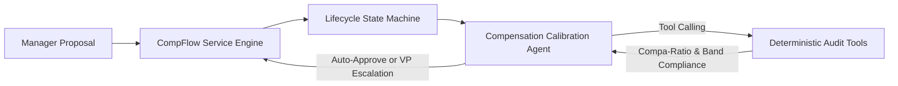

# CompFlow: Agentic Compensation Calibration & Workflow Platform

[](https://github.com/pedrogriff/comp-flow-platform/actions)
[](https://www.python.org/downloads/)
[](https://github.com/astral-sh/ruff)
[](https://mypy-lang.org/)
[]()
[]()

**CompFlow** is an autonomous, agentic calibration and workflow platform designed to streamline enterprise compensation review cycles (Merit, Equity Refreshes, and Promotion Calibrations) using deterministic tool-calling, state machines, and transparent executive decision synthesis.

---

## 🏛️ System Architecture



---

## 💡 Key Engineering Features

1. **Autonomous Agentic ReAct Loop**: Coordinates deterministic tool invocations (`verify_salary_band_compliance`, `evaluate_equity_guidelines`, `evaluate_base_increase_velocity`) to formulate transparent audit decisions.
2. **Deterministic Mathematical Tools**: Evaluates compa-ratios and performance-adjusted equity multipliers with exact `Decimal` precision.
3. **Rigid State Machine (`ReviewStateMachine`)**: Governs lifecycle state transitions from `DRAFT` $\to$ `SUBMITTED` $\to$ `AGENT_AUDITING` $\to$ `AUTO_APPROVED` / `VP_EXCEPTION_REQUIRED` $\to$ `FINALIZED`.
4. **High-Throughput Performance**: Audits 5,000+ complex manager proposals per second with full audit logging and rationale synthesis.

---

## 🚀 Quickstart Example

```python
from decimal import Decimal
from comp_flow.domain import CompensationReviewProposal, JobLevel, PerformanceRating
from comp_flow.service import CompensationWorkflowEngine

# 1. Initialize workflow engine
engine = CompensationWorkflowEngine()

# 2. Register manager compensation review proposal
proposal = CompensationReviewProposal(
    review_id="REV-101",
    employee_id="EMP-500",
    job_level=JobLevel.L5,  # Benchmark: $210k - $250k - $290k
    current_base=Decimal("230000.00"),
    proposed_base=Decimal("250000.00"),  # Compa-Ratio: 1.000
    proposed_equity_gsus=950,           # Target: 900 GSUs
    performance_rating=PerformanceRating.CONSISTENTLY_MEETS,
)
engine.register_draft(proposal)

# 3. Submit and trigger autonomous Agentic Audit
audited = engine.submit_and_audit("REV-101")

print(f"Decision:    {audited.status.value}")
print(f"Compa-Ratio: {audited.audit_result.compa_ratio}")
print(f"Rationale:   {audited.audit_result.rationale}")

# 4. Finalize approved proposal
finalized = engine.finalize_review("REV-101")
print(f"Final State: {finalized.status.value}")
```

---

## 🧪 Testing & Verification

```bash
# Run unit & workflow test suite
pytest --cov=src/comp_flow --cov-report=term-missing tests/

# Strict Type Checking
mypy src/

# Linter Check
ruff check .
```

---

## ⚡ Throughput Benchmark

Run the agentic audit benchmark across 5,000 workforce proposals:

```bash
python -m benchmarks.bench_agent_throughput
```

---

## 📄 License
MIT License. Built by [Pedro](https://github.com/pedrogriff).
