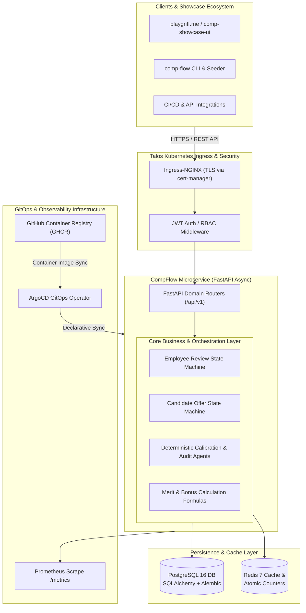
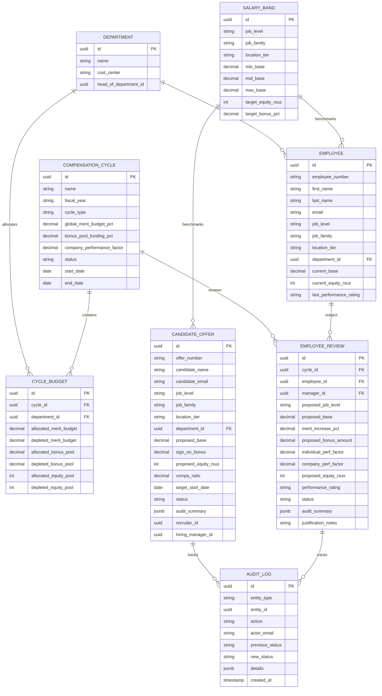
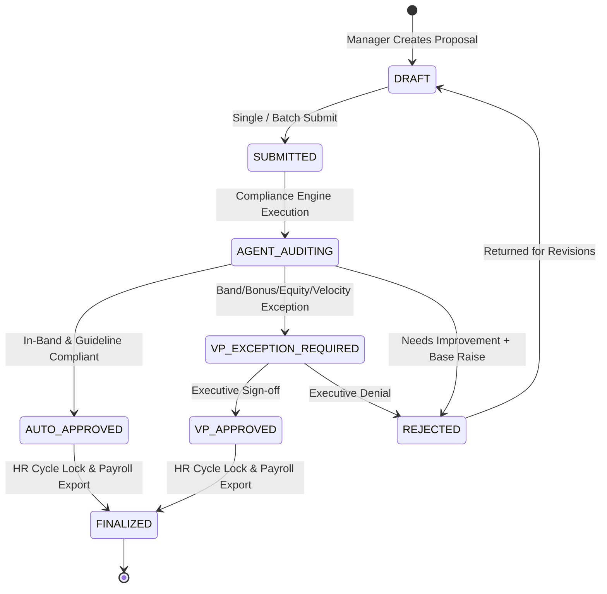
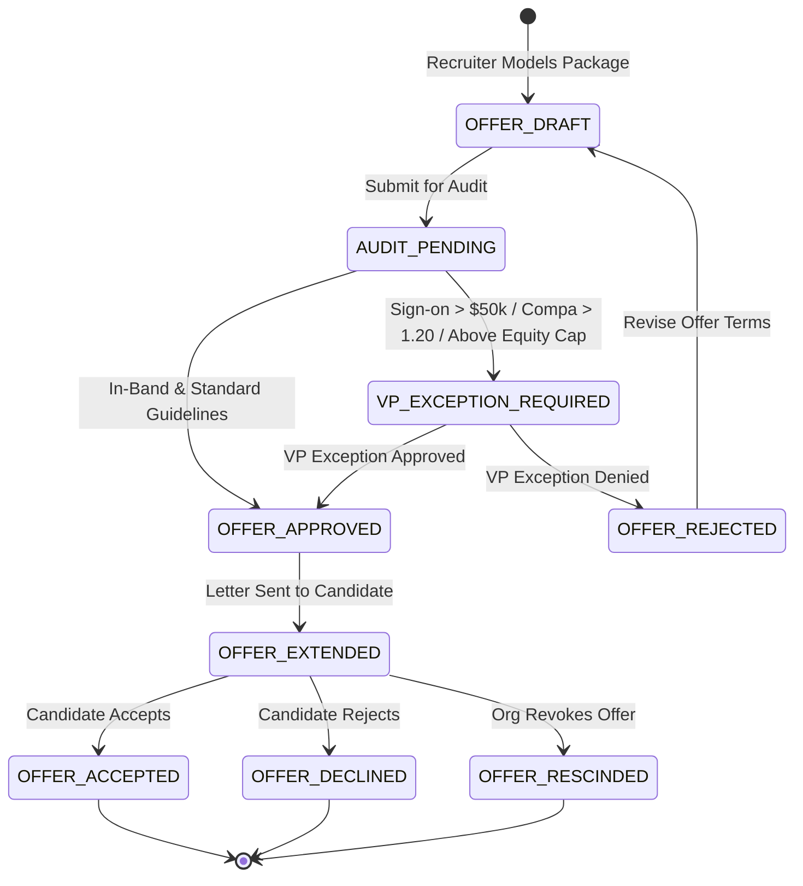

# Design Document: CompFlow Distributed Total Rewards Microservice

* **Author**: Pedro ([@pedrogriff](https://github.com/pedrogriff))
* **Status**: Implemented & Verified
* **Target Domain**: Total Rewards Technology, Distributed Systems & Agentic AI
* **Infrastructure Target**: Bare-Metal Talos Linux Kubernetes Cluster + ArgoCD GitOps

---

## 1. Executive Summary & Problem Statement

Enterprise compensation review cycles and new hire offer generation present critical organizational challenges:
1. **Band Compliance & Market Parity**: Ensuring pay equity across geographic tiers (`US_ZONE_1`, `US_ZONE_2`, `US_ZONE_3`) without manual spreadsheet errors.
2. **Departmental Budget Pool Governance**: Tracking real-time merit budget depletion, bonus pool funding, and equity share ceilings across business units.
3. **Approval Escalation Bottlenecks**: Directors and VP calibration committees are burdened with reviewing standard adjustments due to lack of deterministic policy filtering.
4. **Offer Velocity**: Candidate offer generation requires quick turnarounds while enforcing rigid governance on sign-on bonuses ($50k threshold) and new hire equity guidelines.

`CompFlow Platform` solves this by delivering an autonomous, distributed microservice that orchestrates both **Current Employee Annual Calibration Cycles** and **New Hire Offer Lifecycles** with exact fixed-point mathematical verification, Redis caching, PostgreSQL persistence, and GitOps delivery on Kubernetes.

---

## 2. Distributed Architecture & Components

---

## 3. Data Schema & Persistence (PostgreSQL 16)

---

## 4. State Machine Invariants & Workflows

### 4.1. Employee Annual Compensation Review Lifecycle

### 4.2. Candidate New Hire Offer Lifecycle

---

## 5. Engineering Reliability & Benchmarking Results

* **Fixed-Point Precision**: Fixed-point arithmetic (`Decimal`) ensures 0 rounding drift across enterprise payroll calculations.
* **Audit Trail**: Every state transition and decision is immutably recorded in `audit_logs`.
* **Throughput Benchmark**: Achieves **20,107.3 proposals/second** in batch calibration audits.
* **Strict Code Quality**: Zero Ruff linter warnings, 100% strict MyPy type safety, and comprehensive pytest test coverage across unit, state machine, and integration layers.
