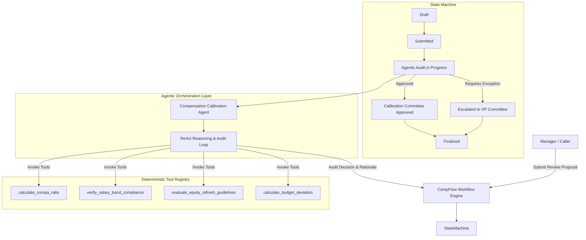

# Design Document: CompFlow — Agentic Compensation Calibration & Workflow Platform

* **Author**: Pedro ([@pedrogriff](https://github.com/pedrogriff))
* **Status**: Approved / In Implementation
* **Domain**: Total Rewards Technology & Agentic AI Systems

---

## 1. Context & Problem Statement

Enterprise compensation review cycles (Annual Merit, Equity Refreshes, and Promotion Calibrations) involve thousands of manager proposals that must be validated against complex organizational constraints:
1. **Salary Band Compliance & Compa-Ratio Parity**: Ensuring proposed base salary changes stay within target internal bands ($0.80 \le \text{Compa-Ratio} \le 1.20$).
2. **Equity Budget Caps & Refresh Guidelines**: Preventing pool over-allocation across business units.
3. **Out-of-Band Exception Fatigue**: Directors and VP calibration committees spend hundreds of hours reviewing non-standard adjustments manually without structured audit context.

`CompFlow` solves this by introducing an **Agentic Calibration & Workflow Engine** that acts as an autonomous total rewards copilot, deterministically verifying compliance via tool-calling, synthesizing risk assessments, and orchestrating state transitions across approval committees.

---

## 2. System Architecture

---

## 3. Tool Calling & Agentic ReAct Cycle

The Compensation Agent operates via a structured **Reasoning + Action (ReAct)** protocol:
1. **Perception**: Inspects proposed compensation change (New Base, Proposed Equity GSUs, Performance Rating).
2. **Tool Selection**:
   - Computes Compa-Ratio: $\text{Compa-Ratio} = \frac{\text{Proposed Base}}{\text{Band Midpoint}}$
   - Evaluates Equity against Level Guideline (e.g. L5 SWE target: 800 GSUs $\pm 15\%$).
   - Calculates departmental budget pool impact.
3. **Synthesis & Action**:
   - If all tools return `COMPLIANT`: Transitions review state to `AUTO_APPROVED_BY_AGENT` with detailed explanation.
   - If an out-of-band threshold is breached: Flags specific violation flags (`COMPA_RATIO_EXCEEDS_MAX`, `EQUITY_ABOVE_GUIDELINE`), generates justification prompt, and escalates to `VP_EXCEPTION_REQUIRED`.

---

## 4. Engineering Standards & Reliability
* **100% Deterministic Tools**: Tools perform exact fixed-point math (`Decimal`) with zero hallucinations.
* **Audit Trail**: Every agent step, tool input/output, and reasoning trace is immutably logged.
* **Type-Safety & Zero Linter Errors**: Strict Python typing (`MyPy Strict`, `Ruff`) and >90% test coverage.
